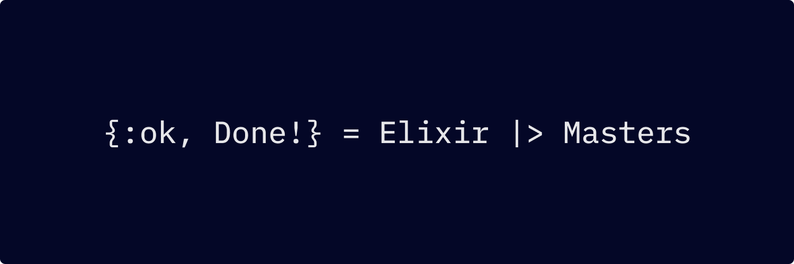

title: Welcome To Elixir Masters!
description: Coding Tutorials For Elixir, Erlang And Phoenix Framework.

<script data-name="BMC-Widget" src="https://cdnjs.buymeacoffee.com/1.0.0/widget.prod.min.js" data-id="anilkulkarni" data-description="Support me on Buy me a coffee!" data-message="Thank you for visiting. You can now buy me a Coffee!" data-color="#FF813F" data-position="" data-x_margin="18" data-y_margin="18"></script>

<!-- Begin Mailchimp Signup Form -->
<link href="//cdn-images.mailchimp.com/embedcode/slim-10_7.css" rel="stylesheet" type="text/css">
<style type="text/css">
	#mc_embed_signup{background:#fff; clear:left; font:14px Helvetica,Arial,sans-serif; }
	/* Add your own Mailchimp form style overrides in your site stylesheet or in this style block.
	   We recommend moving this block and the preceding CSS link to the HEAD of your HTML file. */
</style>

# Elixir Masters



<!-- <iframe width="680" height="382" src="https://www.youtube.com/embed/NbqhRSqtWQs" frameborder="0" allow="accelerometer; autoplay; encrypted-media; gyroscope; picture-in-picture" allowfullscreen></iframe> -->

Considering **Elixir** ? Or maybe just curious ? Chances are you already have some experience with programming or if you are a complete beginner, I couldn't be any more happy!

Before getting along with actual coding, let's get a couple of things straight, Elixir is not a silver bullet to all your problems, ever heard of **Hammer Syndrome**?

It implies that, _"If you only have a hammer, then every problem looks like a nail!"_, but in the practical world things are very different, problems are various and in different domains. Then where would you use Elixir?

## Scenario

Let's consider this, the world basically works by **communication**, communication is required in every aspects of life, products communicate their utility, services communicate their usability, consumer communicate their requirements, etc, and in this world of communication **data** is constantly being passed from one point to another.

**Elixir** is extremely well suited for these applications, it really shines when data has to be transformed and transferred in a highly concurrent, distributed and fault tolerant manner. Often, data has to be transformed to suit the end users, Elixir with all its eco-system is a perfectly capable system for it. Perhaps, that's why products like **WhatsApp (Erlang), Discord & Bleacher Report** rely so highly on it.

## Understanding Elixir

Elixir is a functional programming language, the word **functional** is important as it does not have the concept of **Objects or Classes** and has **immutable data types**, if you come from a **Object Orientated Language** then you need to unlearn a lot of concepts in order to understand the functional paradigm.

Programming need not only be object oriented, functional programming is a beautiful way of thinking, also it takes away a lot of pain as you don't need to keep a track of the state of objects.

## About Erlang/Elixir

Erlang/Elixir looks as if it has a cryptic syntax and functional programming makes them look difficult on the surface, but its really not the case, they are really great to work with and specially **Elixir** is designed to make developers feel **happy**.

We need to give it, other languages did a fantastic job of presenting themself in a much better way, also the amount of marketing, conferences, sponsorships, etc have really shaped them to be much popular and widely used. But being popular does not necessarily mean {++better++}, Erlang and Elixir really shines in what they do, perhaps they just need better marketing efforts.

## What is Erlang, Elixir And Phoenix

[Erlang/OTP](https://www.erlang.org/) is a concurrent functional programming language that forms the basic foundation, it was developed by Ericsson in 1986 and made open source in 1998. Erlang runs on its virtual machine called as the **BEAM**. OTP simply stands for **Open Telecom Platform**.

[Elixir](https://elixir-lang.org/) builds on top of Erlang and provides a nice and easy way of interacting with the underlying system. It provides abstraction over Erlang, so that its easier for developers to code and finally it compiles and runs on BEAM.

[Phoenix Framework](https://www.phoenixframework.org/) is a great set of tooling to create mature and blazing fast web applications, its based on Elixir and offers excellent framework to create highly scalable and concurrent distributed applications.

We would be more focused on **Elixir & Phoenix**, but keep it mind that finally everything is compiled and runs on the BEAM.

Elixir & Phoenix also has very good set of online documentation and the communities are also generally warm and helpful.

Let the magic begin!

## Getting Help

Elixir has a set of very nice online [documentation](https://elixir-lang.org/docs.html) and [guides](https://elixir-lang.org/learning.html).

[Elixir Forum](https://elixirforum.com/) is an excellent place to post queries and interact with the community.

## Code Sample

All code will be in the form of following block

```elixir
# Elixir
defmodule Hello do

  def say do
    :World
  end
  
end
```

<!-- ## Sponsorship

Please contact for sponsoring the project.


 -->

## Get Updates

<div id="mc_embed_signup">
<form action="https://gmail.us2.list-manage.com/subscribe/post?u=29f5cdc1c870267f415252a51&amp;id=c636001afd" method="post" id="mc-embedded-subscribe-form" name="mc-embedded-subscribe-form" class="validate" target="_blank" novalidate>
    <div id="mc_embed_signup_scroll">
	<label for="mce-EMAIL">Subscribe</label>
	<input type="email" value="" name="EMAIL" class="email" id="mce-EMAIL" placeholder="email address" required>
    <!-- real people should not fill this in and expect good things - do not remove this or risk form bot signups-->
    <div style="position: absolute; left: -5000px;" aria-hidden="true"><input type="text" name="b_29f5cdc1c870267f415252a51_c636001afd" tabindex="-1" value=""></div>
    <div class="clear"><input type="submit" value="Subscribe" name="subscribe" id="mc-embedded-subscribe" class="button"></div>
    </div>
</form>
</div>
<!--End mc_embed_signup-->

Once a week updates about new content and articles, thats it!

<!-- Buy me a coffee -->
<script type="text/javascript" src="https://cdnjs.buymeacoffee.com/1.0.0/button.prod.min.js" data-name="bmc-button" data-slug="anilkulkarni" data-color="#FFDD00" data-emoji=""  data-font="Cookie" data-text="Buy me a coffee" data-outline-color="#000" data-font-color="#000" data-coffee-color="#fff" ></script>